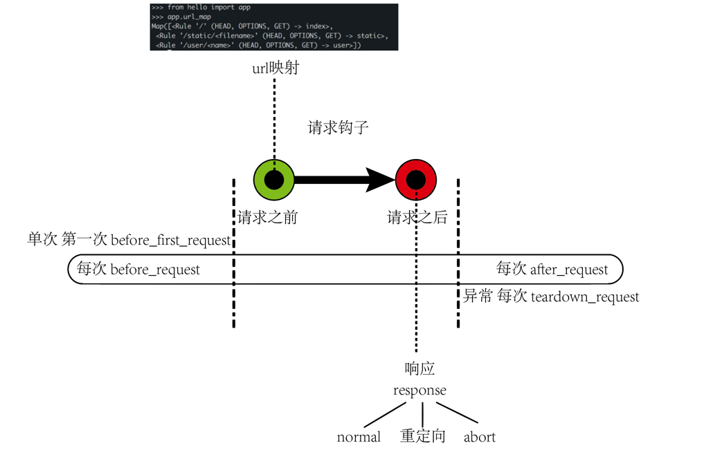

# flask_web_app
flask walking through

## 程序的基本结构
### 共3大部分
1. 初始化
2. 路由和视图函数
3. 启动服务器

## 设计理念--工作方式
+ 请求和响应

### **扩展**

## 社交博客程序 index
- 用户认证
  - Flask的认证扩展
  - 密码安全性
  - 创建认证蓝本
  - 使用Flask-Login认证用户
  - 注册新用户
  - 确认账户
  - 管理账户
- 用户角色
  - 角色在数据库中的表示
  - 赋予角色
  - 角色验证
- 用户资料
  - 资料信息
  - 用户资料页面
  - 资料编辑器
  - 用户头像
- 博客文章
  - 提交和显示博客文章
  - 在资料页中显示博客文章
  - 分页显示长博客列表
  - 使用Markdown和Flask-PageDown支持富文本文章
  - 博客文章的固定链接
  - 博客文章编辑器
- 关注者
  - 再论数据库关系
  - 在资料也中显示关注者
  - 使用数据库联结查询锁关注用户的文章
  - 在首页显示所关注用户的文章
- 用户评论
  - 评论在数据库中的表示
  - 提交和显示评论
  - 管理评论
- 应用编程接口
  - REST 简介
  - 使用Flask提供REST web服务
